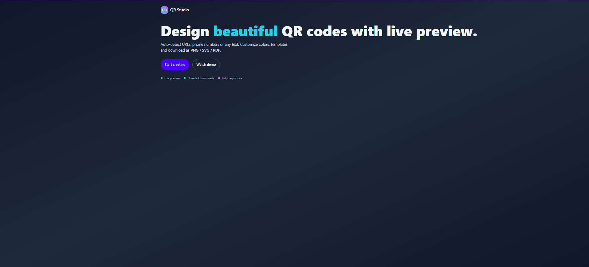
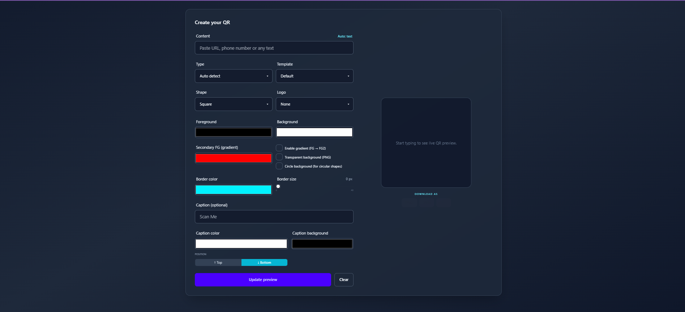
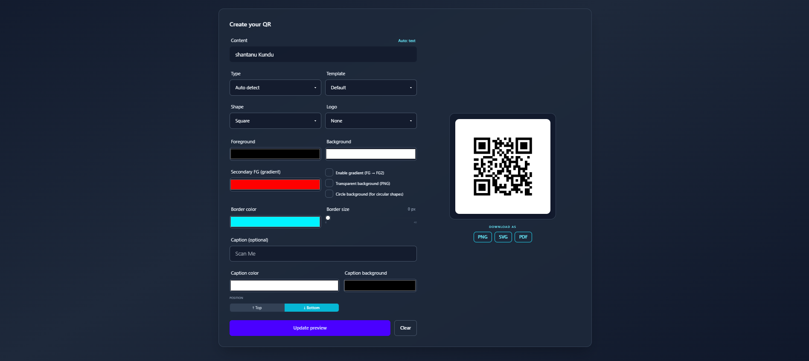

# QR Studio 📱✨  
**Advanced QR Code Generator with Live Preview**

QR Studio is a modern, Django-based web application that allows users to create beautiful, customizable QR codes with real-time preview.  
Users can generate QR codes from URLs, phone numbers, or plain text and download them in multiple formats such as PNG, SVG, and PDF.

---

## 🚀 Overview

QR Studio focuses on flexibility, usability, and visual customization.  
With a clean UI and instant preview, users can design QR codes tailored to their needs without any technical knowledge.

---

## 🔄 Application Workflow

The complete QR generation process is outlined below:

---

### 1️⃣ Landing Page & Introduction
- Clean hero section introducing QR Studio.
- Highlights live preview, one-click downloads, and responsive design.
- Call-to-action buttons guide users to start creating QR codes.

  

  <em>Landing page with project introduction and quick actions</em>

---

### 2️⃣ QR Customization & Live Preview
- Users can enter text, URLs, or phone numbers.
- Auto-detection of input type.
- Customization options include:
  - QR shape and template
  - Foreground & background colors
  - Gradient foreground support
  - Border color and size
  - Optional logo
  - Caption text with position and styling
- Live QR preview updates instantly.

  

  <em>QR customization panel with real-time preview</em>

---

### 3️⃣ Download QR Code
- Generated QR code can be downloaded in:
  - PNG
  - SVG
  - PDF
- Supports transparent background for PNG.
- Output is high-quality and ready for print or digital use.

  

  <em>Final QR code preview with multiple download formats</em>

---

## ✨ Key Features

- ⚡ Live QR code preview
- 🧠 Auto-detect input type (URL, phone, text)
- 🎨 Color, gradient, and shape customization
- 🖼️ Optional logo embedding
- 📝 Caption text with position control
- 📥 Download as PNG / SVG / PDF
- 📱 Fully responsive UI

---

## 🛠️ Technology Stack

- **Backend:** Django (Python)
- **QR Generation:** Python QR libraries
- **Frontend:** HTML, CSS, JavaScript
- **UI Framework:** Modern utility-based styling
- **Export Formats:** PNG, SVG, PDF

---

## 🎯 Use Cases

- Business cards & branding  
- Event posters & tickets  
- Product packaging  
- Portfolio & personal websites  
- Academic and demo projects  

---

## 🔒 Source Code Availability

> **Note:**  
> The source code for QR Studio is private and not publicly available.  
> This repository is created **for documentation, demonstration, and portfolio purposes only**.

---

## 📩 Contact

For collaboration, demo access, or project discussion:

**Author:** Shantanu Kundu  
**Email:** santanuk745@gmail.com  
**Field:** Web Development · Backend Engineering · UI Systems  

---

⭐ Feel free to reach out if you find QR Studio useful or interesting!
